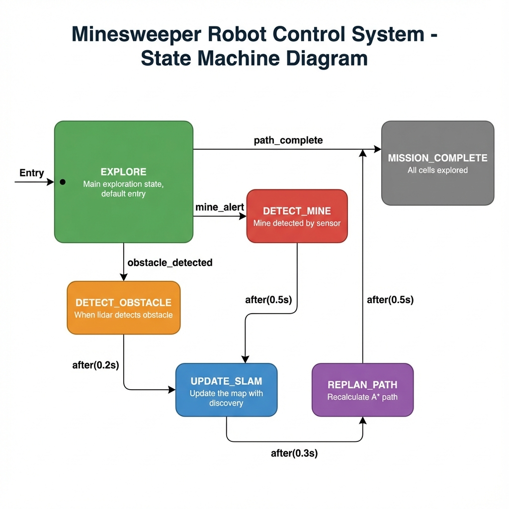

# Minesweeper Robot ROS2 Simulation

A complete MATLAB/Simulink simulation of a minesweeper robot with ROS2 integration, SLAM mapping, and Stateflow-based finite state machine.

[](https://www.mathworks.com/products/matlab.html)
[](https://www.mathworks.com/products/simulink.html)
[](https://docs.ros.org/en/humble/)

## 🎯 Project Overview

This project simulates a robot that:
- **Explores** an unknown environment using a boustrophedon coverage path
- **Detects mines** and obstacles using simulated Lidar and mine detector sensors
- **Builds a SLAM map** in real-time as it discovers obstacles
- **Replans paths** dynamically using A* algorithm when obstacles are found
- **Communicates via ROS2** topics for sensor data and control commands

## 📁 Project Structure

```
minesweeper_ros2/
├── main_ros2.m                    # ★ Main simulation entry point
├── setup_project.m                # Project setup script
├── README.md                      # This file
├── config/
│   └── robot_params.m             # All configuration parameters
├── docs/
│   ├── ARCHITECTURE.md            # Technical architecture docs
│   ├── architecture_diagram.png   # System architecture image
│   └── stateflow_diagram.png      # FSM diagram image
├── models/
│   └── minesweeper_stateflow.slx  # Simulink/Stateflow FSM model
├── scripts/
│   ├── buildStateflowModel.m      # Programmatic Stateflow builder
│   ├── core/                      # Core classes
│   │   ├── OccupancyGridWorld.m   # Occupancy grid map
│   │   ├── MinefieldGenerator.m   # Mine/obstacle generation
│   │   ├── MinesweeperRobot.m     # Robot model
│   │   └── Visualization.m        # Visualization utilities
│   ├── sensors/                   # Sensor simulation
│   │   ├── SensorSimulator.m      # Lidar & detector simulation
│   │   └── EKFSLAM.m              # Extended Kalman Filter SLAM
│   ├── planning/                  # Path planning & FSM
│   │   ├── PathPlanner.m          # Basic path planner
│   │   ├── PathPlannerROS.m       # A* planner with ROS2
│   │   └── StateMachine.m         # Finite State Machine
│   └── ros2/                      # ROS2 integration
│       ├── ROS2Interface.m        # ROS2 communication
│       └── ROS2TopicManager.m     # Topic management
└── results/
    └── ...                        # Simulation outputs
```

## 🏗️ Architecture

The project follows a **6-step modular architecture**:


### Module Descriptions

| Step | Module | Description |
|------|--------|-------------|
| 1 | **Occupancy Grid World** | Creates 20x20 grid map with mines and obstacles |
| 2 | **Sensors & ROS2** | Lidar (360°, 3m range), Mine Detector, ROS2 topics |
| 3 | **EKF-SLAM** | Extended Kalman Filter for localization and mapping |
| 4 | **Stateflow FSM** | Finite State Machine: Explore, Detect, Mark, Replan |
| 5 | **A* Path Planner** | Dynamic path planning avoiding discovered obstacles |
| 6 | **Simulation Flow** | Main loop integrating all components |

## 🔄 Stateflow State Machine

The robot behavior is controlled by a Stateflow FSM with 6 states:




## 🚀 Quick Start

### Prerequisites
- MATLAB R2023a or later
- Simulink
- Stateflow
- ROS Toolbox (optional, for external ROS2)
- Navigation Toolbox (for occupancyMap)

### Running the Simulation

1. **Open MATLAB** and navigate to the project folder:
   ```matlab
   cd('c:\Users\yousef\mapping')
   ```

2. **Setup project** (first time only):
   ```matlab
   setup_project
   ```

3. **Run the main simulation**:
   ```matlab
   main_ros2
   ```

4. **Build the Stateflow model** (optional):
   ```matlab
   buildStateflowModel('minesweeper_stateflow')
   ```

## 📊 Visualization

The simulation displays a **dual-panel view**:

| Left Panel (Original World) | Right Panel (SLAM Map) |
|----------------------------|------------------------|
| Ground truth with all obstacles | Robot's discovered knowledge |
| Gray squares = All obstacles | Blue dots = Lidar point cloud |
| Red X = All mines | Green circles = Detected mines |
| Cyan trail = Robot path | Yellow line = Optimal path |

### Sensor Simulation

- **Lidar**: 360° scan, 5° resolution, 3m range
- **Mine Detector**: Only detects mines in current cell
- **Point Cloud**: Accumulates lidar hits with realistic noise

## 🔌 ROS2 Topics

| Topic | Message Type | Description |
|-------|-------------|-------------|
| `/robot/pose` | `geometry_msgs/Pose2D` | Robot position (x, y, theta) |
| `/mine_alert` | `std_msgs/Bool` | Mine detection signal |
| `/map` | `nav_msgs/OccupancyGrid` | SLAM occupancy grid |
| `/cmd_vel` | `geometry_msgs/Twist` | Velocity commands |
| `/scan` | `sensor_msgs/LaserScan` | Lidar scan data |

## ⚙️ Configuration

Edit `config/robot_params.m` to customize:

```matlab
robot.max_velocity = 2.0;       % m/s
robot.max_angular_velocity = 3.0; % rad/s
sim.dt = 0.005;                  % Timestep
grid.rows = 20;                  % Grid size
grid.cols = 20;
mineDensity = 0.15;              % 15% mines
numObstacles = 10;               % Number of obstacles
```

## 📈 Features

- ✅ Occupancy Grid SLAM with real-time visualization
- ✅ Lidar point cloud simulation (MathWorks style)
- ✅ Dynamic A* path replanning
- ✅ Stateflow FSM for robot behavior
- ✅ ROS2 integration ready
- ✅ Dual-panel visualization (Original vs SLAM)
- ✅ Mine and obstacle avoidance
- ✅ Shortest path calculation after exploration

## 📝 License

This project is for educational purposes.

## 👤 Author

Yousef - Minesweeper Robot ROS2 Simulation Project
