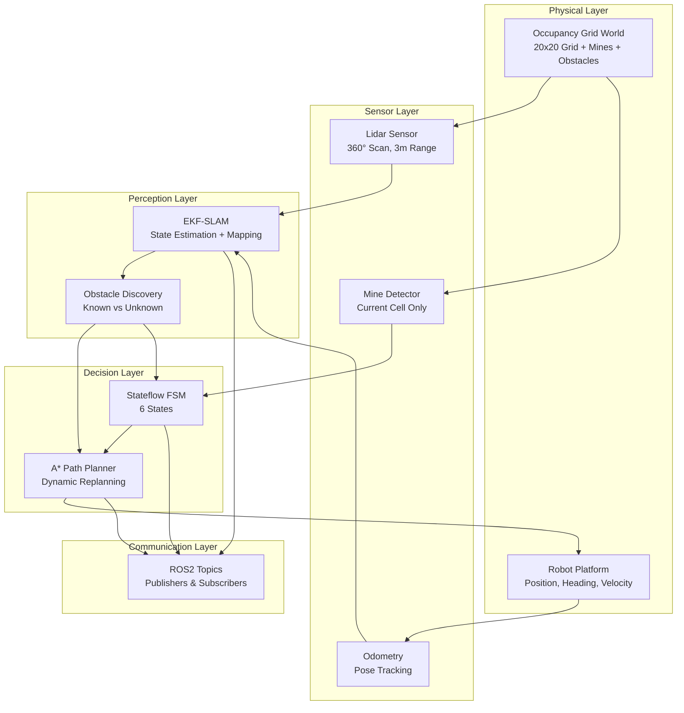
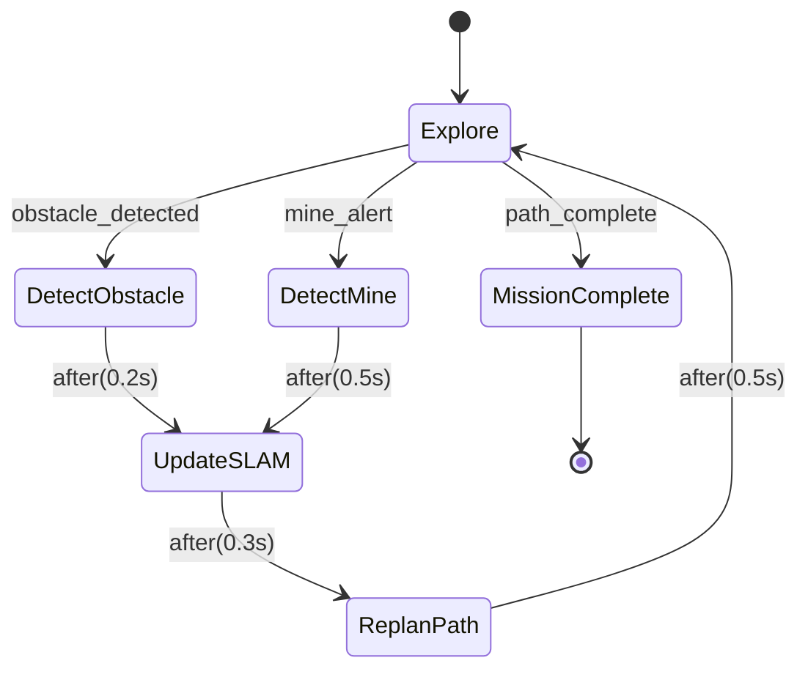
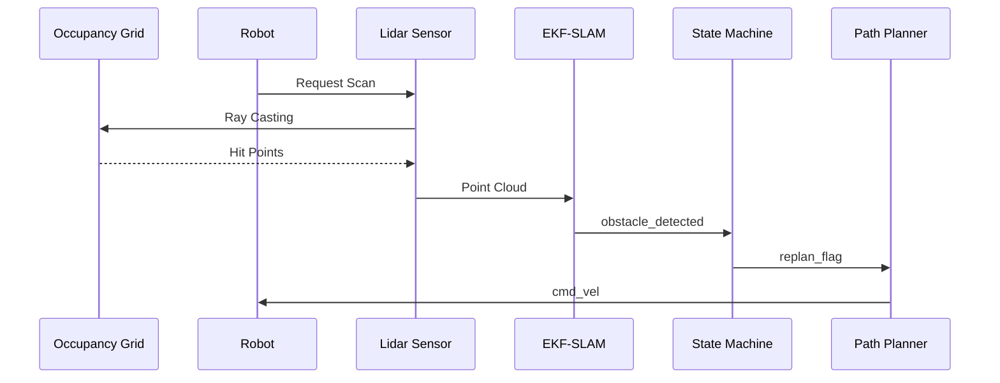

# Minesweeper Robot - System Architecture

## High-Level Architecture

## State Machine Flow

## Data Flow

## Component Details

### Step 1: Occupancy Grid World
- **File**: `OccupancyGridWorld.m`
- **Function**: Creates and manages the simulation environment
- **Features**:
  - Configurable grid size (default 20x20)
  - Random mine placement (15% density)
  - Random obstacle placement (10 obstacles)
  - Coordinate conversion (grid ↔ world)

### Step 2: Sensors & ROS2
- **Files**: `SensorSimulator.m`, `ROS2TopicManager.m`
- **Lidar**: 360° scan, 5° resolution, 3m range
- **Mine Detector**: Binary detection on current cell
- **Topics**: `/scan`, `/odom`, `/mine_alert`, `/map`, `/cmd_vel`

### Step 3: EKF-SLAM
- **File**: `EKFSLAM.m`
- **Function**: Extended Kalman Filter for simultaneous localization and mapping
- **Inputs**: Lidar scans, odometry
- **Outputs**: Robot pose estimate, occupancy map

### Step 4: Stateflow FSM
- **Files**: `StateMachine.m`, `buildStateflowModel.m`
- **States**: 
  1. Explore - Following coverage path
  2. DetectObstacle - Obstacle discovered
  3. UpdateSLAM - Add to known map
  4. ReplanPath - A* recalculation
  5. DetectMine - Mine detected
  6. MissionComplete - All cells explored

### Step 5: A* Path Planner
- **File**: `PathPlannerROS.m`
- **Algorithm**: A* with Manhattan heuristic
- **Features**:
  - Coverage path generation
  - Dynamic replanning on discovery
  - Obstacle and mine avoidance

### Step 6: Simulation Flow
- **File**: `main_ros2.m`
- **Function**: Main entry point integrating all components
- **Features**:
  - Dual-panel visualization
  - Real-time lidar point cloud
  - Dynamic path updates
